# Seichi Portal

Seichi Portalは、整地鯖の運営でこれまで使っていた Google Formsを一元化するためのアプリケーションです。

このリポジトリは、プロジェクトの目的や関連リポジトリを整理するためのものです。

## プロジェクトの目的

これまでギガンティック☆整地鯖の運営では、Google Formsを用いてユーザーからの要望等を管理してきました。しかし、フォームの種類が増えるにつれ管理が煩雑になってきたことから、内製化の機運が高まりました。

## 関連リポジトリ

|名称|説明|
|---|---|
|[seichi-portal-frontend](https://github.com/GiganticMinecraft/seichi-portal-frontend)|Node.jsを用いたSPA バックエンドやMicrosoftなどの外部APIと通信を行い、ユーザーに情報を視覚的に提供する|
|[seichi-portal-backend](https://github.com/GiganticMinecraft/seichi-portal-backend)|Rustを用いたWebサーバー REST APIを用いてフロントエンドと通信を行い、データの管理や加工を行う|
|[seichi-api-schema](https://github.com/GiganticMinecraft/seichi-api-schema)|Seichi Portal のAPIの定義|

## プロジェクト俯瞰図

## ライセンス

[Apache License 2.0](./LICENSE)
