# このリポジトリについて

このリポジトリは、プロジェクトの目的や関連リポジトリを整理するためのものです。

# seichi-portal

seichi-portalは、整地鯖の運営でこれまで使っていた Google Formsを一元化するためのアプリケーションです。ご利用は[こちら](https://portal.seichi.click)から。

## プロジェクトの目的

これまでギガンティック☆整地鯖の運営では、Google Formsを用いてユーザーからの要望等を管理してきました。
しかし、フォームの種類が増えるにつれ管理が煩雑になってきたことから、内製化の機運が高まりました。
また、整地鯖で統一されたプレイヤーとの連絡やゲーム内との深い連携手段があることのメリットが大きいことも理由の一つです。

## 関連リポジトリ

|名称|説明|
|---|---|
|[seichi-portal-frontend](https://github.com/GiganticMinecraft/seichi-portal-frontend)|Node.jsを用いたSPA バックエンドやMicrosoftなどの外部APIと通信を行い、ユーザーに情報を視覚的に提供する|
|[seichi-portal-backend](https://github.com/GiganticMinecraft/seichi-portal-backend)|Rustを用いたWebサーバー REST APIを用いてフロントエンドと通信を行い、データの管理や加工を行う|
|[seichi-portal-api-schema](https://github.com/GiganticMinecraft/seichi-portal-api-schema)|seichi-portal のAPIの定義|

## プロジェクト俯瞰図

## ライセンス

[Apache License 2.0](./LICENSE)
